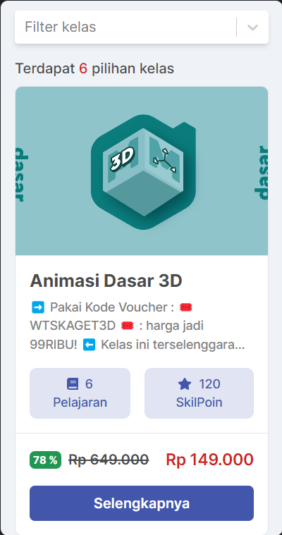
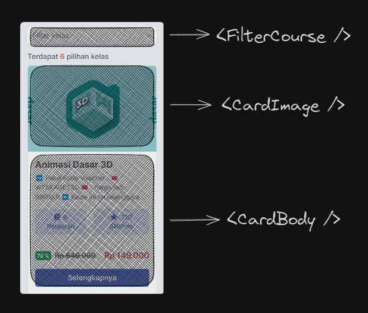

> Note! 📝
>
> React Native dan React JS mempunyai penjelasan yang kurang lebih sama tentang _Component_.

Di React Native, Komponen adalah bagian dari antarmuka pengguna (UI) yang dapat diakses, diulang, dan digunakan kembali. Komponen ini dapat berisi elemen antarmuka pengguna seperti teks, gambar, tombol, dan formulir.

Mari kita lihat UI kursus Skillvul:

.

Pada UI tersebut, terdapat setidaknya tiga UI yang paling terlihat, yaitu filter, gambar card, dan konten dari card. Dengan React kamu di mungkinkan membuat **komponen** yang secara khusus ditargetkan pada UI itu sendiri.

<!--
<iframe src="https://snack.expo.dev/@doltons/konsep-dasar-component" height="500" width="1500"></iframe> -->

Setiap UI yang ada dalam satu card tersebut bisa dibuatkan _Component_. Kita membuat `<FilterCourse />` untuk UI Filter, `<CardImage />` untuk gambar, dan bagian yang menampung content nya di buatkan component bernama `<CardBody />`

> Note! 📝
>
> Penamaan component bisa di buat bebas tapi sebisa mungkin sesuai dengan konteks nya
>
> Pembuatan component menggunakan _TitleCase_, contoh: IniComponent, MainHeader, MainFooter

Pada materi berikutnya kita akan belajar cara membuat component ini di React Native.

# Quiz

## Easy (5 poin)

1.  Bagaimana seharusnya penamaan component

    - A. `<InputDate />`
    - B. `<input-date />`
    - C. `<inputDate />`
    - D. `<InputDate`
