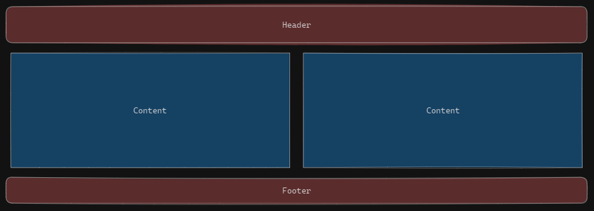

# Membuat Component

## Functional Component

Functional Component merupakan salah satu cara membuat komponen dalam React Native yang digunakan untuk membangun antarmuka pengguna (UI).

<iframe src="https://snack.expo.dev/@doltons/functional-component" height="500" width="100%"></iframe>

Kita membuat nama component dengan _TitleCase_ yang di dalamnya me-_return_ sebuah **Elemen React**. Konsep ini sama dengan yang ada di materi **React JS**.

## Class Component (legacy)

Cara lain membuat component adalah dengan bentuk _class_. Perlu di ingat bahwa untuk jaman sekarang **sangat jarang** kalian menemui developer menggunakan bentuk Class Component ini.

<iframe src="https://snack.expo.dev/@doltons/class-component" height="500" width="100%"></iframe>

Gimana? Ada terlihat perbedaan?. Keliatannya functional component lebih mudah di buat ya?

> Note! 📝
>
> Buat kalian yang ingin tau kisah dari Class Component kenapa di katakan _Legacy_: https://www.w3schools.com/react/react_class.asp

### Tugas Latihan!

Mari lihat gambar di bawah



Dari UI tersebut, kita bisa membuat nya menjadi paling tidak 3 component:

1. Header
2. Content
3. Footer

Cobalah buat component sederhana dengan **functional component**. Ikuti langkah di bawah:

1. Lakukan instalasi React Native
2. Buat folder bernama `/components`
3. Buat 3 file di dalam folder `/components` berisi sesuai dengan UI yang kita lihat di atas
4. Pada folder `/components/Header.jsx` masukkan kode di bawah

```jsx
import { View, Text } from "react-native";

const Header = () => {
  return (
    <View>
      <Text>Ini Header</Text>
    </View>
  );
};

export default Header;
```

5. Lanjutkan untuk 2 component lainnya

<br />

# Quiz

## Easy (5 Poin)

1. Apa yang membedakan antara functional component dan class component dalam React Native?

   - A. Functional component menggunakan "class" keyword, sedangkan class component menggunakan "function" keyword.
   - B. Functional component merupakan versi terbaru dari class component.
   - [x] C. Functional component adalah fungsi JavaScript biasa, sedangkan class component merupakan class JavaScript yang diwarisi dari React.Component.
   - D. Functional component hanya digunakan untuk state management, sedangkan class component hanya digunakan untuk rendering tampilan.

## Medium (10 Poin)

2. Manakah di bawah ini penggunaan functional component dalam React Native

   - [x] A.

   ```jsx
   import React from "react";
   import { View, Text } from "react-native";

   const ShowGreeting = () => {
     return (
       <View>
         <Text>Hello, World!</Text>
       </View>
     );
   };

   export default ShowGreeting;
   ```

   - B.

   ```jsx
   import React from "react";
   import { View, Text } from "react-native";

   class ShowGreeting extends React.Component {
     render() {
       return (
         <View>
           <Text>Hello, World!</Text>
         </View>
       );
     }
   }

   export default ShowGreeting;
   ```

   - C.

   ```jsx
   import React from "react";
   import { View } from "react-native";

   function showGreeting() {
     return (
       <View>
         <Text>Hello, World!</Text>
       </View>
     );
   }

   export default showGreeting;
   ```

   - D.

   ```jsx
   import React, { Component } from "react";

   class ShowGreeting extends Component {
     render() {
       return (
         <View>
           <Text>Hello, World!</Text>
         </View>
       );
     }
   }

   export default ShowGreeting;
   ```
