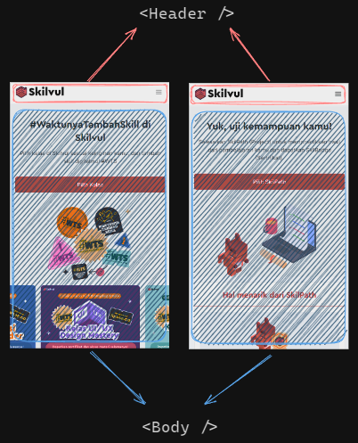
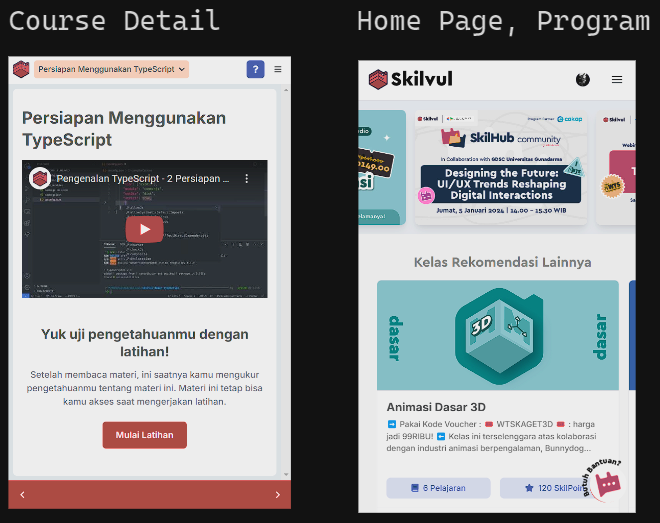

# Passing Component



Umumnya baik itu Website ataupun Aplikasi akan selalu ada _section_ yang konsisten. Seperti contoh di atas, Header selalu sama walaupun berpindah _screen_.

Kita bisa saja membuat tiap _screen_ mengimport header yang sama, contoh:

```jsx
const CourseScreen = () => {
  return (
    <View>
      <Header />
      {/* Konten body */}
    </View>
  );
};

const SkilpathScreen = () => {
  return (
    <View>
      <Header />
      {/* Konten body */}
    </View>
  );
};
```

Atau dengan cara yang lebih elegan

```jsx
const MainLayout = (props) => {
  return (
    <View>
      <Header />
      {props.children}
    </View>
  );
};
```

## Passing Component sebagai children

React memungkinkan kamu untuk _passing_ component lewat _props_. Salah satu cara untuk melakukan itu adalah dengan memanfaatkan _props children_.

_props children_ sederhananya adalah apapun yang kalian letakkan di dalam suatu component sebagai anak dari component tersebut

Mari lihat implementasinya:

<iframe src="https://snack.expo.dev/@doltons/props-component" height="500" width="100%"></iframe>

Perhatikan penggunaan `<MainLayout>` di `SkilpathScreen`. Sebelumnya kita membuat `MainLayout` yang akan menerima children dengan meletakkan `{props.children}` pas di bawah header. Maka apapun component yang menjadi _child_ dari `SkilpathScreen` akan di letakkan di posisi yang sama yaitu di bawah header.

```jsx
// ./components/MainLayout
const MainLayout = (props) => {
  return (
    <View>
      <Header />
      {props.children}
    </View>
  );
};

// App.js
const SkilpathScreen = () => {
  return (
    <MainLayout>
      <Text>Konten Skilpath</Text>
    </MainLayout>
  );
};
```

<!-- ## Passing Component lewat Props

Ada juga cara lain untuk _passing componenot_ tanpa menggunakan _props children_.

Contoh case: `Header` yang memiliki _breadcrumbs_ hanya ada di halaman detail course, `Header` yang memiliki icon profile user hanya ada di halaman `homepage` dll.



Pada contoh di atas, kedua `Header` nya serupa tapi ada perbedaan untuk halaman spesifik, Yang sebelah kiri di pakai di seluruh halaman dan hanya Header sebelah kanan yang di hanya dipakai di course detail

Gimana dong kalau kayak gini? pakai children lagi?. Bisa saja, tapi  -->

<!--
Dalam React Native, props adalah cara untuk mengirimkan data dari komponen induk ke komponen anak. Selain data, kita juga dapat mengirimkan komponen itu sendiri sebagai prop. Ini disebut "Passing Component". Passing component memungkinkan kita untuk menyusun komponen yang lebih dinamis dan dapat digunakan ulang.

**Passing Component:**
Passing component adalah ketika kita mengirimkan suatu komponen sebagai nilai prop ke komponen lain, sehingga komponen penerima bisa merender dan memanipulasi komponen tersebut.

**Contoh Kode:**

<iframe src="https://snack.expo.dev/@doltons/props-component" height="500" width="100%"></iframe>

Misalkan kita memiliki komponen `Header` yang akan ditampilkan di beberapa layar yang berbeda:

Path: `components/Header.js`

```jsx
import React from "react";
import { View, Text } from "react-native";

const Header = ({ title, children }) => {
  return (
    <View>
      <Text style={{ fontSize: 20 }}>{title}</Text>
      {children}
    </View>
  );
};

export default Header;
```

Di sini, kita memiliki prop `title` dan juga menggunakan `{props.children}` untuk merender elemen apa pun yang dilewatkan sebagai child dalam komponen.

Kemudian, kita dapat menggunakan komponen `Header` di beberapa layar dengan cara yang berbeda:

Path: `App.js`

```jsx
import React from "react";
import { View } from "react-native";
import Header from "./Header";

const ScreenA = () => {
  return (
    <View>
      <Header title="Halaman A" />
      {/* Konten layar lainnya */}
    </View>
  );
};

const ScreenB = () => {
  return (
    <View>
      <Header title="Halaman B">
        <Text>Ini adalah konten tambahan di header</Text>
      </Header>
      {/* Konten layar lainnya */}
    </View>
  );
};

const App = () => {
  return (
    <View>
      <ScreenA />
      <ScreenB />
    </View>
  );
};

export default App;
``` -->

<!-- **Penjelasan Kode:**

- Kita mengimpor komponen `Header` yang telah kita buat sebelumnya.
- Di `ScreenA`, kita hanya meneruskan prop `title` ke komponen `Header`.
- Di `ScreenB`, kita meneruskan prop `title` serta menambahkan elemen teks sebagai child di dalam komponen `Header`.

Dengan cara ini, kita dapat menggunakan komponen `Header` secara dinamis di berbagai layar dengan konten yang berbeda-beda. Ini memungkinkan kita untuk merancang komponen yang dapat digunakan ulang dan lebih fleksibel dalam menyusun antarmuka pengguna. -->
